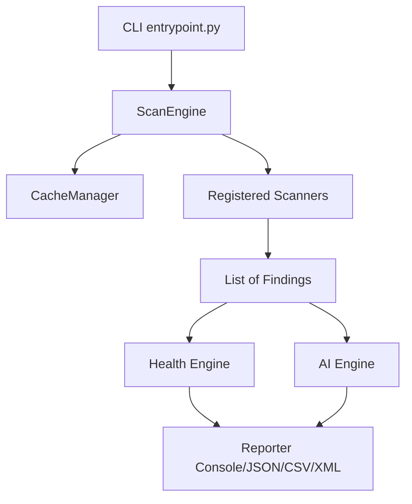

# Architecture Overview

HealCode is designed with a frozen core scanner pipeline that prioritizes performance, deterministic execution, and decoupling.

## Subsystems

## Scanner Registry
All diagnostic scanners inherit from `IScanner` and are registered dynamically in `ScanCommand.run()`. Global scanners run once per scan target, while path-specific scanners evaluate matching repository files.
